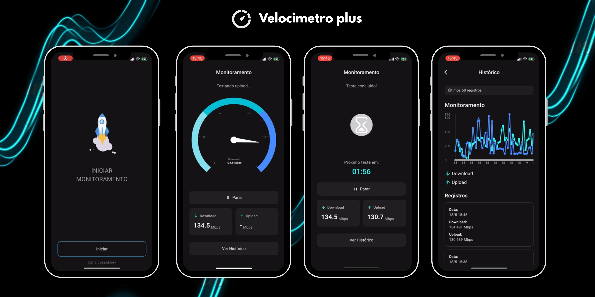
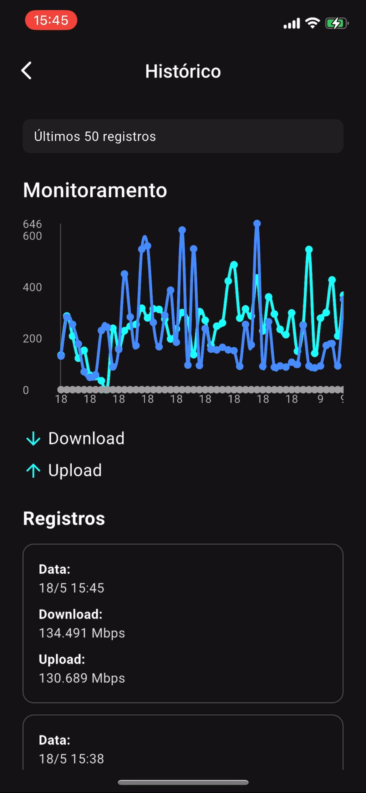
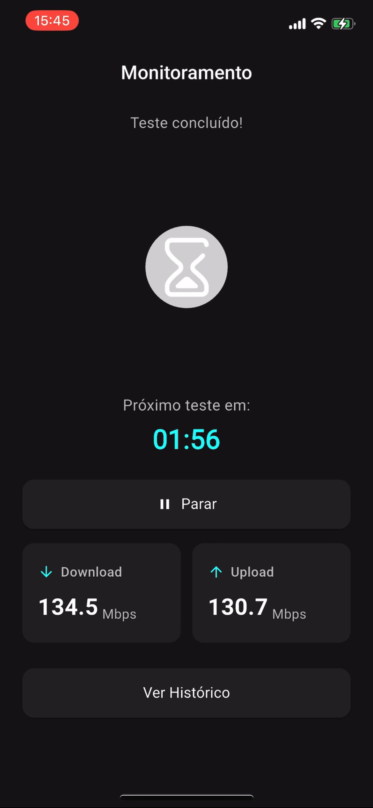
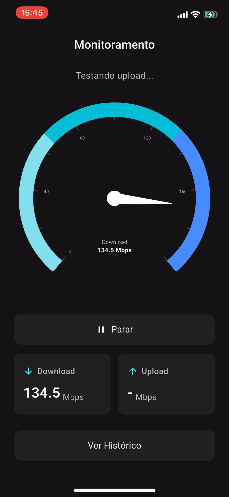

# Velocímetro Plus



## Sobre o app

O **Velocímetro Plus** é um app feito em Flutter que monitora sua internet de forma automática. A cada 2 minutos, ele faz um novo teste de velocidade (download e upload) e salva os resultados localmente — mesmo se o app estiver em segundo plano.

Ele foi pensado para quem quer entender de verdade a qualidade da sua conexão ao longo do tempo.

---

## O que ele faz

- Testa a velocidade da internet (download e upload)
- Funciona automaticamente a cada 2 minutos
- Continua rodando em segundo plano
- Salva os últimos 50 resultados direto no celular
- Mostra gráficos e históricos detalhados
- Tem uma interface escura e moderna
- Usa BLoC pra manter tudo organizado por trás

---

## Tecnologias que usei

- **Flutter** – pra fazer o app inteiro
- `flutter_speed_test_plus` – faz os testes de velocidade
- `workmanager` – permite rodar em background
- `flutter_bloc` – controle de estado
- `shared_preferences` – salva os dados localmente
- `syncfusion_flutter_gauges` – velocímetro estilo gauge
- `fl_chart` – gráficos bonitos e simples
- `connectivity_plus` – verifica se há internet antes de testar

---

## Prints do app

| Tela Inicial                   | Testando | Contagem Regressiva | Histórico |
|--------------------------------|----------|----------------------|-----------|
|  |  |  |  |

---

## Como rodar

```bash
git clone https://github.com/marcossantana03/velocimetroplus.git
cd velocimetroplus
flutter pub get
flutter run
